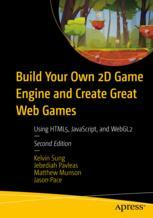

# Apress Source Code  [*Access via browser*](https://apress.github.io/build-your-own-2d-game-engine-2e/)

This repository accompanies [*Build Your Own 2D Game Engine and Create Great Web Games*](https://link.springer.com/book/10.1007/978-1-4842-7377-7) by Kelvin Sung, Jebediah Pavleas, Matthew Munson, and Jason Pace (Apress, 2022).

[comment]: #cover

Download the files as a zip using the green button, or clone the repository to your machine using Git.

## Releases

Release v1.0 corresponds to the code in the published book, without corrections or updates.

## Contributions

See the file Contributing.md for more information on how you can contribute to this repository.
